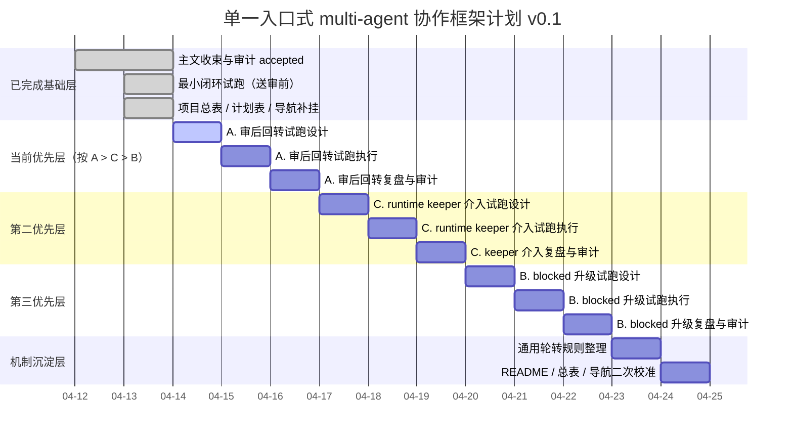

# 单一入口式 multi-agent 协作框架 · 甘特图计划 v0.1

- 日期：2026-04-13
- 起草：粉雪
- 执行人：粉雪
- 状态：active
- 性质：项目计划图表
- 用途：把当前项目按单元拆成可跟踪的甘特图计划，并标注每个单元所需配件 / 依赖件，避免后续推进继续散在聊天里。
- 上位文档：
  - `/Users/xiaojingbo/.openclaw/workspace/knowledge-base/04-Inspection/2026-04-13-单一入口式multi-agent协作框架_项目总表_v0.1.md`
- 同位文档：
  - `/Users/xiaojingbo/.openclaw/workspace/knowledge-base/04-Inspection/2026-04-13-单一入口式multi-agent协作框架_后续计划表_v0.1.md`
  - `/Users/xiaojingbo/.openclaw/workspace/knowledge-base/04-Inspection/2026-04-13-试跑复盘_单一入口式multi-agent最小闭环_v0.1.md`
- 下位文档：
  - 待补：逐单元检查清单
- 所属任务：
  - 单一入口式 multi-agent 协作框架：图表化计划与单元依赖标注
- 责任人：
  - 主归属位：粉雪
  - 协助位：Curie
  - 审查位：Anna

---

## 一、当前阶段说明

当前项目状态：
- 主文：已 accepted
- 送审前最小闭环试跑：已完成
- 当前总缺口：闭环还未验证“审后回转 / runtime keeper 真实介入 / blocked 升级”

Anna 当前建议优先顺序：
- **A. 审后回转试跑**
- **C. runtime keeper 介入试跑**
- **B. blocked 升级试跑**

排序：
> **A > C > B**

---

## 二、甘特图（Mermaid）

---

## 三、单元计划表（含配件需求）

### 0. 已完成基础单元（回顾）

#### 单元 0-1：主文收束与审计
- 状态：已完成
- 主产物：`单一入口式multi-agent协作框架-主文_v0.1.md`
- 已有配件需求：
  - 一级骨架
  - 主文审计意见
  - 最小修订回合
- 当前作用：作为后续所有试跑与轮转的上位依据

#### 单元 0-2：送审前最小闭环试跑
- 状态：已完成
- 主产物：`试跑复盘_单一入口式multi-agent最小闭环_v0.1.md`
- 已有配件需求：
  - 最小单元模板
  - 阶段门模板
  - 审计插入规则
  - 停损规则卡
  - 两单元串行编排卡
- 当前作用：证明“入口编排 → 生产 → 回收 → 串行补口 → 复盘 → 送审准备”成立

---

### A. 审后回转试跑

#### 单元 A-1：审后回转试跑编排
- 状态：待做
- 主产物：审后回转试跑编排卡
- 配件需求：
  - 主文 v0.1
  - 阶段门模板
  - 审计插入规则
  - 项目总表
- 要回答的问题：
  - accepted 后怎么进入下一阶段
  - revision-needed 后怎么回本阶段
  - 主入口位审后默认动作是什么

#### 单元 A-2：审后回转试跑执行
- 状态：待做
- 主产物：审后回转试跑记录 / 产物链
- 配件需求：
  - A-1 编排卡
  - 一个可送审对象
  - Anna 审计结论
- 要回答的问题：
  - 审计结论出来后，链是否会再次停住
  - 主入口位是否能接着转

#### 单元 A-3：审后回转复盘与审计
- 状态：待做
- 主产物：审后回转复盘件
- 配件需求：
  - A-2 试跑结果
  - Anna 审后判断
  - 项目总表状态更新
- 要回答的问题：
  - 回转链是否成立
  - 是否还需单独补“审后回转规则卡”

---

### C. runtime keeper 介入试跑

#### 单元 C-1：keeper 介入试跑编排
- 状态：待做
- 主产物：keeper 介入试跑编排卡
- 配件需求：
  - 主文 v0.1
  - 停损规则卡
  - 审计插入规则
  - 项目总表
- 要回答的问题：
  - 触发 keeper 介入的最小场景怎么设计
  - keeper 只提醒、不越位，怎么验证

#### 单元 C-2：keeper 介入试跑执行
- 状态：待做
- 主产物：keeper 介入试跑记录 / 产物链
- 配件需求：
  - C-1 编排卡
  - 一个可制造卡断/悬空/假推进信号的最小场景
- 要回答的问题：
  - keeper 是否能接链
  - 是否会与主入口 / 审计位混位

#### 单元 C-3：keeper 介入复盘与审计
- 状态：待做
- 主产物：keeper 介入复盘件
- 配件需求：
  - C-2 试跑结果
  - Anna 审计判断
  - 项目总表状态更新
- 要回答的问题：
  - keeper 是否从定义层进入证据层

---

### B. blocked 升级试跑

#### 单元 B-1：blocked 升级试跑编排
- 状态：待做
- 主产物：blocked 升级试跑编排卡
- 配件需求：
  - 主文 v0.1
  - 停损规则卡
  - 项目总表
- 要回答的问题：
  - 什么样的最小场景足以触发 blocked
  - blocked 后如何升级，不误伤普通 revision-needed

#### 单元 B-2：blocked 升级试跑执行
- 状态：待做
- 主产物：blocked 升级试跑记录 / 产物链
- 配件需求：
  - B-1 编排卡
  - 一个可触发 blocked 的最小场景
  - Anna / 人类拍板位配合结论
- 要回答的问题：
  - blocked 后能否进入升级链，而不是悬空

#### 单元 B-3：blocked 升级复盘与审计
- 状态：待做
- 主产物：blocked 升级复盘件
- 配件需求：
  - B-2 试跑结果
  - 审计 / 拍板结论
  - 项目总表状态更新
- 要回答的问题：
  - blocked 升级链是否成立
  - 是否需要独立 blocked 升级卡

---

## 四、当前最小配件需求总览

### 已具备的配件 / 基础件
- 主文 v0.1
- 最小单元模板
- 阶段门模板
- 审计插入规则
- 停损规则卡
- 两单元串行编排卡
- 最小闭环试跑复盘
- 后续计划表
- 项目总表

### 当前仍缺的关键配件 / 规则件
- 审后回转试跑编排卡
- 审后回转复盘件
- keeper 介入试跑编排卡
- keeper 介入复盘件
- blocked 升级试跑编排卡
- blocked 升级复盘件
- 更通用轮转规则（后续再判断是否独立成件）

---

## 五、当前使用规则

1. 后续推进先回本甘特图计划
2. 每个单元都要明确：
   - 主产物
   - 配件需求
   - 当前状态
   - 是否可开始
3. 未列进图表和单元表的动作，不默认开做
4. 若优先顺序变化，先改本表，再改项目总表

---

## 六、5 字段 handoff
- **Where**
  - `/Users/xiaojingbo/.openclaw/workspace/knowledge-base/04-Inspection/2026-04-13-单一入口式multi-agent协作框架_甘特图计划_v0.1.md`
- **What**
  - 将当前项目收成甘特图计划，并按每个单元标注所需配件 / 依赖件。
- **How to verify**
  - 检查文档是否包含：甘特图、单元计划表、每单元配件需求、当前已具备基础件、当前仍缺的关键配件、当前使用规则。
- **Known Issues**
  - 当前是 v0.1，时间轴按逻辑顺序表达，尚未绑定真实日历排期与工时估算。
- **Next Steps**
  - 若继续推进，先按本计划表检查 A-1 是否已具备开跑条件；如条件变化，先更新本表。
